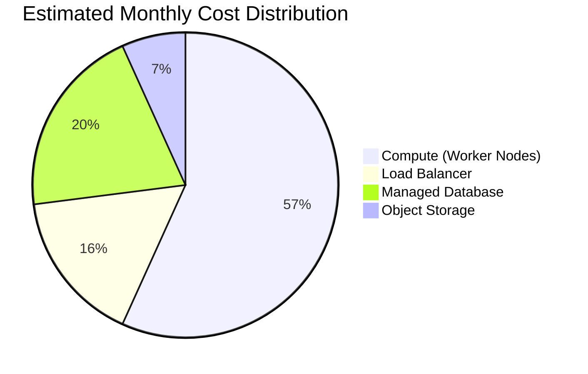

# Cloud Cost Estimate: DigitalOcean

This document provides a monthly cost estimate for deploying our enterprise application on DigitalOcean using a starter high-availability, cloud-native architecture.

The following estimate is based on DigitalOcean's pricing as of late 2023 and is intended for planning purposes. Actual costs may vary based on usage, data transfer, and selected service tiers.

## Cost Breakdown

| Service Component | Configuration | Estimated Monthly Cost |
| :--- | :--- | :--- |
| **Kubernetes** | 1 DOKS Control Plane | $0.00 (Free) |
| **Compute** | 3 x Basic Droplets (Worker Nodes) | ~$42.00 |
| **Load Balancer** | 1 DigitalOcean Load Balancer | ~$12.00 |
| **Database** | 1 Managed PostgreSQL Cluster (Starter) | ~$15.00 |
| **Object Storage** | 1 Spaces Bucket (Starter Tier) | ~$5.00+ |
| **Total** | | **~$74.00+** |

## Cost Visualization

The pie chart below illustrates the approximate distribution of the monthly costs for the core infrastructure components.

## Notes & Disclaimers

*   **Worker Nodes:** The compute cost assumes three basic DigitalOcean Droplets (e.g., the $14/mo tier). This provides high availability for the application workloads. Costs will scale with the size and number of nodes.
*   **Load Balancer:** A load balancer is required to route external traffic to the services running in the Kubernetes cluster.
*   **Object Storage:** DigitalOcean Spaces includes a free tier, with the $5 plan being the next step up, covering a significant amount of storage and bandwidth. Costs will increase with higher storage and data transfer needs.
*   **Data Transfer:** Inbound data transfer is generally free. Outbound data transfer has a generous allowance per Droplet, but exceeding it will incur additional costs.
*   **Other Services:** This estimate does not include costs for other potential services like managed Redis, or more advanced monitoring and logging services. 