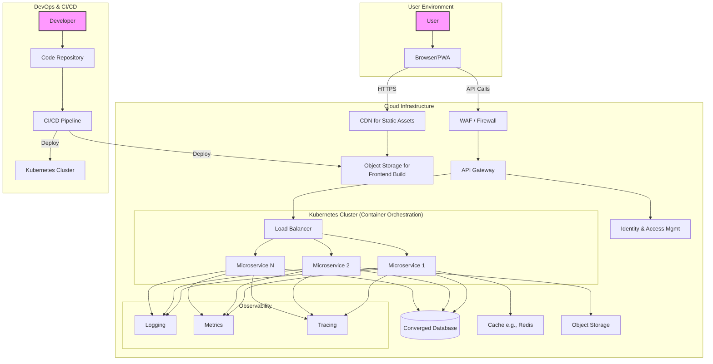

# Enterprise-Grade Web App Template: A Development Plan

This document outlines the architecture and step-by-step plan for creating a reusable, enterprise-grade web application template. The architecture is designed to be scalable, secure, maintainable, and cloud-native.

## High-Level Architecture

The following diagram illustrates the major components of the architecture and their interactions.

## Phased Development Plan

This plan is broken down into logical phases, starting with foundational setup and progressing through development, security, automation, and deployment.

### Phase 1: Foundation & Project Setup
- [x] 1. Initialize a monorepo for the project using Git for version control.
- [x] 2. Set up the project structure with separate directories for `frontend`, `backend`, and `infrastructure`.

### Phase 2: Backend - Microservices & Infrastructure
- [x] 3. Set up a Kubernetes cluster for container orchestration.
  - For local development, enable the Kubernetes cluster included with Docker Desktop.
  - For production, the plan is to provision a managed Kubernetes cluster (e.g., OKE, EKS, GKE) using the Infrastructure as Code scripts from Phase 5.
- [x] 4. Set up a database.
  - For local development, run PostgreSQL in a Docker container.
  - For production, the plan is to provision a managed Converged Database (e.g., Oracle Autonomous Database, Aurora) to support various data models (relational, JSON, graph).
- [ ] 5. Develop the first microservice (e.g., 'User Service') using Nest.JS.
- [ ] 6. Containerize the 'User Service' using Docker.
- [ ] 7. Implement a caching layer using a managed service like Redis for performance.
- [ ] 8. Set up managed Object Storage for storing large files and user uploads.

### Phase 3: Frontend - Single-Page Application (SPA)
- [ ] 9. Develop the SPA frontend using a modern framework like React or Angular.
- [ ] 10. Configure the frontend to be served from a CDN with Object Storage as the origin for low-latency delivery.

### Phase 4: API, Security & Communication
- [ ] 11. Define the API contracts for all microservices using the OpenAPI specification.
- [ ] 12. Configure an API Gateway to manage, secure, and route API requests to the appropriate microservices.
- [ ] 13. Implement a Web Application Firewall (WAF) to protect against common web exploits.
- [ ] 14. Set up an Identity Provider (e.g., OCI IAM, Auth0) for user authentication and authorization (OAuth 2.0/OIDC).

### Phase 5: DevOps - CI/CD Automation
- [ ] 15. Create a CI/CD pipeline for the backend services to automatically build, test, scan for vulnerabilities, and deploy container images to the Kubernetes cluster.
- [ ] 16. Create a separate CI/CD pipeline for the frontend to build, test, and deploy the static assets to Object Storage.
- [ ] 17. Implement Infrastructure as Code (IaC) using Terraform or a similar tool to manage and provision cloud resources.

### Phase 6: Observability
- [ ] 18. Configure a centralized logging solution (e.g., OCI Logging Analytics, ELK stack) to aggregate logs from all microservices.
- [ ] 19. Implement a monitoring and alerting system (e.g., OCI Monitoring, Prometheus/Grafana) to track application metrics and system health.
- [ ] 20. Set up distributed tracing (e.g., Jaeger, Zipkin) via a service mesh to monitor requests across microservices.

### Phase 7: Final Deployment & Review
- [ ] 21. Deploy the full application to a staging environment for end-to-end testing.
- [ ] 22. Conduct a final security audit and performance testing before production deployment. 